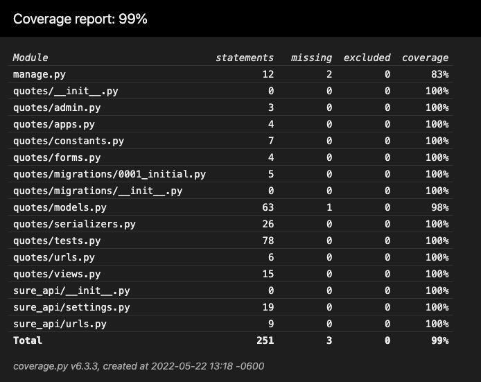

# Sure's Backend Engineering Take-home Challenge

### by Zack Petersen

[LinkedIn](https://www.linkedin.com/in/zackcpetersen/) | [GitHub](https://github.com/zackcpetersen)
| [Portfolio](https://zackcpetersen.com/)

[See Project On Github](https://github.com/zackcpetersen/sure_api)

To get started, clone or download the repo into your project directory. Navigate into the new folder. From there,
run`pipenv install --dev`
to install all package reqs including dev pages (like `coverage` - so you can see full test coverage in this project!)

After all requirements are installed, go ahead and run
`pipenv shell` to activate the virtual environment.

Once you're in the shell, run the following commands to run tests and generate a coverage report.

```
python manage.py test -v 2
coverage run manage.py test
coverage html
```

Access and run the coverage report at `sure_api/htmlcov/index.html` - coverage is at 99%



Once the tests are complete, create a user and start the server to checkout the API endpoints. <br>
`python manage.py createsuperuser` - follow prompts to create your user <br>
`python manage.py runserver`

This project has two main API endpoints: <br>
[127.0.0.1:8000/api/quotes](http://127.0.0.1:8000/api/quotes/) <br>
[127.0.0.1:8000/api/checkout-quote/?quote=<quote_id>](http://127.0.0.1:8000/api/checkout-quote/?quote=<quote_id>)

Now, navigate to [127.0.0.1:8000/api/quotes](http://127.0.0.1:8000/api/quotes/) to create a new quote (note - you can
also access the admin to accomplish this - [127.0.0.1:8000/admin/](http://127.0.0.1:8000/admin/)).

Create a quote using the HTML form provided or the raw data block and note the `quote_id` returned from the response,
you'll need it for the next step.

Now navigate to 
[127.0.0.1:8000/api/checkout-quote/?quote=<quote_id>](http://127.0.0.1:8000/api/checkout-quote/?quote=<quote_id>) 
to see the quote policy costs.

Thanks for taking some time to review my project! Have a great rest of your day.
